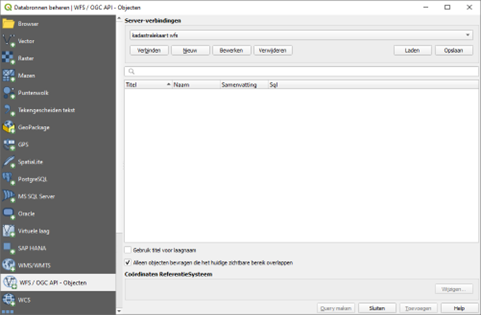
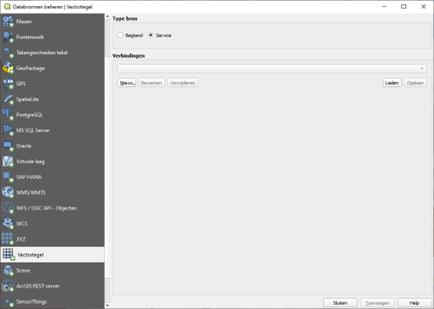
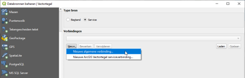
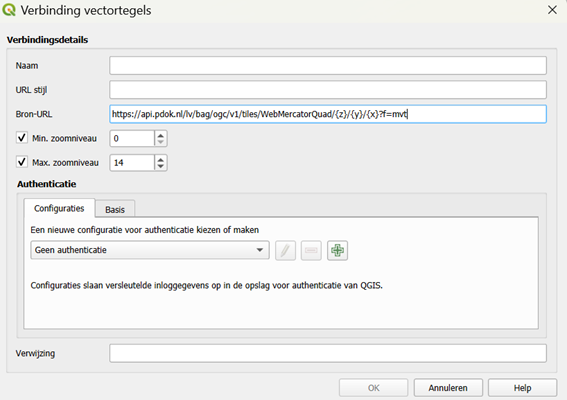
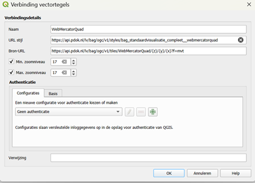
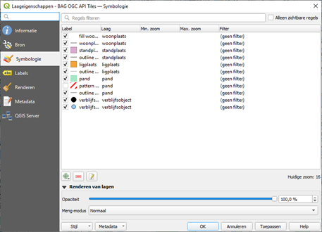
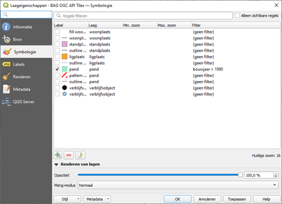

# Werken met OGC API - Features en Tiles in QGIS

Praktische oefening voor het werken met OGC API - Features en OGC API - Tiles in QGIS.

## Inhoudsopgave

- [1 OGC API](#1-ogc-api)
  - [1.1 OGC API - Features](#11-ogc-api---features)
    - [1.1.1 In QGIS](#111-in-qgis)
  - [1.2 OGC API - Tiles](#12-ogc-api---tiles)
    - [1.2.1 Landing page](#121-landing-page)
    - [1.2.2 In QGIS](#122-in-qgis)
    - [1.2.3 Styling](#123-styling)
    - [1.2.4 OpenAPI specification](#124-openapi-specification)

## 1 OGC API

In de volgende oefeningen gaan we aan de slag met OGC API’s. PDOK heeft onder andere de twee basisregistraties BAG en BGT als OGC API beschikbaar gesteld. 

### 1.1 OGC API - Features

We gaan aan de slag met de OGC API - Features. Het moderne alternatief voor WFS, die je features (objecten) geeft.  
PDOK heeft een OGC API voor de BGT beschikbaar gesteld. De landingspagina vind je hier: <https://api.pdok.nl/lv/bgt/ogc/v1_0>

#### 1.1.1 In QGIS

We gaan de OGC API Features van de BGT inladen in QGIS.

- Open het venster **Databronnen beheren** in QGIS en ga naar het tabblad **WFS / OGC API - Objecten**.

- Gebruik hier de URL <https://api.pdok.nl/lv/bgt/ogc/v1> en maak verbinding.
- Kies een kaartlaag en voeg deze toe aan je kaartvenster. Tip: zoom ver in zodat niet heel Nederland ingeladen hoeft te worden.
- Bekijk in de logging de requests die verstuurd worden via Fn-12 en vergelijk deze eens met WFS requests. Wat valt je op?

### 1.2 OGC API - Tiles

We gaan nu aan de slag met de OGC API - Tiles. Dit is het moderne alternatief voor WMS en WMTS. Deze geeft geen objecten, maar tiles. Anders dan bij WMS of WMTS zijn dit vector tiles. Dat betekent dat er geen plaatjes, maar kleine gecomprimeerde vectorbestanden over gestuurd worden. Dit is een fundamenteel andere techniek dan tiles als png-afbeeldingen. Dat betekent dat je er veel meer mee kunt. Je kunt bijvoorbeeld zelf de styling aanpassen. En vector tiles schalen netjes mee waardoor het beeld nooit pixelig wordt.

PDOK heeft een OGC API voor de BAG beschikbaar gesteld. Deze staat hier: <https://api.pdok.nl/lv/bag/ogc/v1_0>

#### 1.2.1 Landing page

- Open de landing page van de PDOK BAG API (bovenstaande URL).
- Ga naar de **Tiles**-pagina.
- Kies de Tile Matrix Set **WebMercatorQuad**. Je krijgt meteen een voorvertoning.
- Zie je het verschil in CRS?

Een Tile Matrix Set specificeert hoe de tiles zijn opgebouwd:

- Welke zoomlevels zijn er?
- Hoe groot is de set, wat is de ruimtelijke dekking?

- Bekijk de metadata van de **WebMercatorQuad** Tile Matrix Set (ook wel tiling scheme).
- Welke zoomniveau’s zijn beschikbaar?
- Vergelijk de metadata van de verschillende Tile Matrix Sets. Waarom hebben deze verschillende dimensies (minimale x en y) en zoomniveau’s?
- Wat vertegenwoordigen `{z}`, `{x}` en `{y}` in de URL?

Er worden ook verschillende stijlen beschikbaar gesteld.

- Ga naar de Styles-pagina: <https://api.pdok.nl/lv/bag/ogc/v1_0/styles>
- Welke stijlen zijn er beschikbaar voor de BAG?

#### 1.2.2 In QGIS

Tijd om de BAG vector tiles te bekijken in QGIS.

- Open het venster **Databronnen beheren** en ga naar het tabblad **Vectortegel**.

- Ga naar <https://api.pdok.nl/lv/bag/ogc/v1_0/tiles> en kopieer de URL **template** van de **WebMercatorQuad** Tile Matrix Set.

Helaas ondersteunt QGIS op dit moment alleen WebMercator Vector Tiles, en nog geen RD vector tiles, hoewel die dus wel worden aangeboden door PDOK.

- Ga weer terug naar het venster in QGIS en klik op **Nieuw -> Nieuwe algemene verbinding**.

- Bedenk een naam.
- Plak bij **URL** de URL template.
- Neem als min. zoomniveau **17** en als max. zoomniveau **17** (het zoomniveau dat is gespecificeerd in de metadata).

- Voeg de kaartlaag toe aan je kaartvenster en bekijk deze.
- Bekijk in de logging de requests die verstuurd worden en vergelijk deze eens met WMS requests. Wat valt je op?

#### 1.2.3 Styling

We gaan styling toevoegen die door PDOK is gemaakt. Daarna gaan we zien dat je zelf ook gemakkelijk styling kunt maken en aanpassen.

- Verwijder eerst de BAG-kaartlaag uit je kaartvenster.
- Open **Databronnen beheren** en ga naar het tabblad **Vectortegels**.
- Klik op **Bewerken** bij de BAG OGC API Tiles-verbinding.
- Kopieer vanaf de Styles-pagina (<https://api.pdok.nl/lv/bag/ogc/v1_0/styles>) een style-URL voor de **WebMercatorQuad**-set.

- Klik op **OK** en **Toevoegen**.
- Bekijk de vectortiles in het kaartvenster.

Het is een best wel drukke styling, maar die kunnen we zelf aanpassen.

- Open de **Symbologie**.

- Doe zelf wat aanpassingen. Haal bijvoorbeeld het streeppatroon voor panden weg, en geef de panden een ander kleurtje.
- Je kunt ook filteren in de kolom **Filteren**. Filter bijvoorbeeld eens op het bouwjaar van panden.
- Schakel in de symbologie alle lagen behalve **pand** uit.
- Stel het volgende filter in: **bouwjaar > 1990**.

- Bekijk het resultaat in het kaartvenster.

Wat hebben we nu gezien: een vector tile is een hybride vorm tussen WFS en WMTS. Het combineert de voordelen en lost veel nadelen op:

- Het is niet zo traag als WFS omdat het de data als tegels aanbiedt.
- Het biedt vectordata aan, in tegenstelling tot WMTS of WMS die je png-afbeeldingen geven. Daardoor kun je zelf de styling aanpassen en filteren.
- Tegelijkertijd kan de aanbieder ook vooraf gedefinieerde styling meegeven, zodat je die niet zelf hoeft te maken.

De OGC API - Tiles is daarmee een hele goede vervanger van WMS en WMTS en zelfs voor heel veel zaken waarvoor je een WFS zou gebruiken.

Gefeliciteerd, je kent nu de belangrijkste mogelijkheden van de OGC API’s.

#### 1.2.4 OpenAPI specification

Er wordt veel ondersteund in de GUI van QGIS, maar nog niet alles. De OGC API’s bieden heel veel mogelijkheden. Alle mogelijkheden staan op de OpenAPI specification-pagina, en hier kun je die ook meteen in de browser uitproberen: <https://api.pdok.nl/lv/bag/ogc/v1_0/api>  
Dit kun je ook gebruiken om werkende API-calls op te bouwen voor later gebruik.

Met dank aan Geonovum. Meer oefeningen zijn hier te vinden: <https://github.com/Geonovum/ogc-api-workshops/tree/main/01%20introductie/handson>

## Colofon

**Versie:** 2026  
**Status:** Definitief  
**Auteur:** Derek van Bochove  
**Organisatie:** Geon bv  

Leonard Springerlaan 37  
9727 KB Groningen  
Telnr. (050) 311 16 60  
E-mail: info@geon.nl  
Website: www.geon.nl
